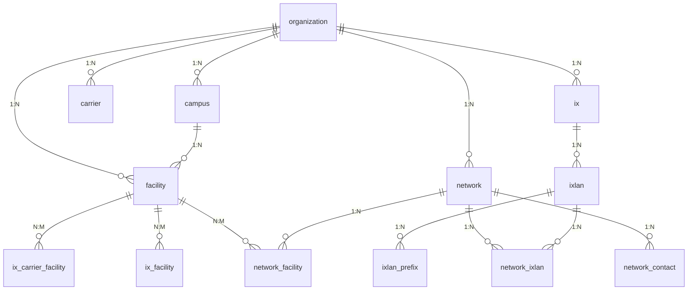

# 数据特征备忘

- peeringdb_network_ixlan.asn = peeringdb_network.asn asn在这两个表中的值总是相等的
- 

# 字段说明

### **字段解释**

#### **1. 核心实体表**
---

##### **`peeringdb_campus`（园区）**
- **字段**：
  - `id`：唯一标识符（主键）。
  - `status`：状态（如活跃、停用）。
  - `name`：园区名称（唯一）。
  - `org_id`：关联的组织（外键，指向 `peeringdb_organization`）。
  - `social_media`：社交媒体链接（JSON格式）。
  - `website`：官方网站。
- **用途**：表示物理园区（如数据中心集群）。

---

##### **`peeringdb_carrier`（运营商）**
- **字段**：
  - `name`：运营商名称（唯一）。
  - `org_id`：所属组织（外键）。
  - `aka`：别名。
  - `website`：运营商官网。
- **用途**：描述网络运营商（如电信公司、ISP）。

---

##### **`peeringdb_facility`（设施）**
- **字段**：
  - `address1`/`address2`：设施地址。
  - `country`/`city`：所在国家/城市。
  - `latitude`/`longitude`：地理坐标。
  - `campus_id`：所属园区（外键，指向 `peeringdb_campus`）。
  - `org_id`：管理组织（外键）。
  - `clli`：设施编码（电信行业标准）。
- **用途**：具体设施（如数据中心大楼）。

---

##### **`peeringdb_ix`（互联网交换点）**
- **字段**：
  - `name`：IXP名称（唯一）。
  - `country`/`city`：所在国家/城市。
  - `proto_unicast`/`proto_multicast`：支持单播/组播。
  - `org_id`：运营组织（外键）。
  - `ixf_net_count`：连接的ASN数量。
- **用途**：互联网交换点（如DE-CIX、AMS-IX）。

---

##### **`peeringdb_ixlan`（IXP局域网）**
- **字段**：
  - `ix_id`：所属IXP（外键）。
  - `vlan`：VLAN ID。
  - `rs_asn`：路由服务器ASN。
  - `mtu`：最大传输单元。
- **用途**：定义IXP的物理或逻辑网络（如IPv4/IPv6子网）。

---

##### **`peeringdb_network`（网络/ASN）**
- **字段**：
  - `asn`：自治系统号（唯一）。
  - `org_id`：所属组织（外键）。
  - `info_prefixes4`/`info_prefixes6`：IPv4/IPv6前缀数量。
  - `policy_general`：对等互联策略（如Open/Selective）。
- **用途**：描述一个自治系统（AS）及其策略。

---

##### **`peeringdb_organization`（组织）**
- **字段**：
  - `name`：组织名称（唯一）。
  - `country`/`city`：总部所在地。
  - `social_media`：社交媒体链接（JSON格式）。
- **用途**：管理其他实体的组织（如CDN公司、ISP）。

---

#### **2. 关系表**
---

##### **`peeringdb_ix_carrier_facility`（IX-运营商-设施关联）**
- **字段**：
  - `carrier_id`：运营商ID（外键）。
  - `fac_id`：设施ID（外键）。
- **用途**：表示运营商在设施中的存在。

---

##### **`peeringdb_ix_facility`（IX-设施关联）**
- **字段**：
  - `ix_id`：IXP ID（外键）。
  - `fac_id`：设施ID（外键）。
- **用途**：表示IXP所在的物理设施。

---

##### **`peeringdb_network_ixlan`（网络-IXP连接）**
- **字段**：
  - `net_id`：网络ID（外键）。
  - `ixlan_id`：IX局域网ID（外键）。
  - `ipaddr4`/`ipaddr6`：在IXP上的IP地址。
  - `speed`：连接速率（Mbps）。
- **用途**：记录网络在IXP上的具体连接信息。

---

### **ER图结构**


#### **关键关系说明**
1. **组织（`organization`）** 是核心实体，管理所有其他实体（园区、设施、IXP等）。
2. **IXP（`ix`）** 与 **设施（`facility`）** 是多对多关系（通过 `ix_facility` 表）。
3. **网络（`network`）** 通过 `network_ixlan` 表连接到 **IX局域网（`ixlan`）**。
4. **运营商（`carrier`）** 与 **设施（`facility`）** 是多对多关系（通过 `ix_carrier_facility` 表）。

---

### **数据流向示例**
1. **查找某ASN（如AS12345）在哪些IXP有连接**：
   ```sql
   SELECT ix.name, network_ixlan.ipaddr4 
   FROM peeringdb_network 
   JOIN peeringdb_network_ixlan ON peeringdb_network.id = network_ixlan.net_id 
   JOIN peeringdb_ixlan ON network_ixlan.ixlan_id = peeringdb_ixlan.id 
   JOIN peeringdb_ix ON peeringdb_ixlan.ix_id = peeringdb_ix.id 
   WHERE peeringdb_network.asn = 12345;
   ```
2. **查询某IXP（如DE-CIX）的所有成员网络**：
   ```sql
   SELECT network.asn, network.name 
   FROM peeringdb_ix 
   JOIN peeringdb_ixlan ON peeringdb_ix.id = peeringdb_ixlan.ix_id 
   JOIN peeringdb_network_ixlan ON peeringdb_ixlan.id = peeringdb_network_ixlan.ixlan_id 
   JOIN peeringdb_network ON peeringdb_network_ixlan.net_id = peeringdb_network.id 
   WHERE peeringdb_ix.name = 'DE-CIX Frankfurt';
   ```

通过此结构，可以清晰管理全球互联网基础设施的对等互联数据。

# table定义

## entity

### campus

```sql
-- auto-generated definition
create table peeringdb_campus
(
    id           integer      not null
        primary key autoincrement,
    status       varchar(255) not null,
    created      datetime     not null,
    updated      datetime     not null,
    version      integer      not null,
    name         varchar(255) not null
        unique,
    name_long    varchar(255),
    aka          varchar(255),
    notes        text         not null,
    org_id       integer      not null
        references peeringdb_organization
            deferrable initially deferred,
    social_media text         not null,
    website      varchar(255) not null,
    check ((JSON_VALID("social_media") OR "social_media" IS NULL))
);

create index peeringdb_campus_org_id_10f58fda
    on peeringdb_campus (org_id);
```

### carrier

```sql
-- auto-generated definition
create table peeringdb_carrier
(
    id           integer      not null
        primary key autoincrement,
    status       varchar(255) not null,
    created      datetime     not null,
    updated      datetime     not null,
    version      integer      not null,
    name         varchar(255) not null
        unique,
    aka          varchar(255) not null,
    name_long    varchar(255) not null,
    notes        text         not null,
    org_id       integer      not null
        references peeringdb_organization
            deferrable initially deferred,
    social_media text         not null,
    website      varchar(255) not null,
    check ((JSON_VALID("social_media") OR "social_media" IS NULL))
);

create index peeringdb_carrier_org_id_d3ea36d7
    on peeringdb_carrier (org_id);
```

### facility

```sql
-- auto-generated definition
create table peeringdb_facility
(
    id                          integer      not null
        primary key autoincrement,
    status                      varchar(255) not null,
    created                     datetime     not null,
    updated                     datetime     not null,
    version                     integer      not null,
    address1                    varchar(255) not null,
    address2                    varchar(255) not null,
    city                        varchar(255) not null,
    state                       varchar(255) not null,
    zipcode                     varchar(48)  not null,
    country                     varchar(2)   not null,
    latitude                    decimal,
    longitude                   decimal,
    name                        varchar(255) not null
        unique,
    website                     varchar(255) not null,
    clli                        varchar(18)  not null,
    rencode                     varchar(18)  not null,
    npanxx                      varchar(21)  not null,
    notes                       text         not null,
    org_id                      integer      not null
        references peeringdb_organization
            deferrable initially deferred,
    sales_email                 varchar(254) not null,
    sales_phone                 varchar(192) not null,
    tech_email                  varchar(254) not null,
    tech_phone                  varchar(192) not null,
    floor                       varchar(255) not null,
    suite                       varchar(255) not null,
    aka                         varchar(255) not null,
    name_long                   varchar(255) not null,
    diverse_serving_substations bool,
    property                    varchar(27),
    region_continent            varchar(255),
    status_dashboard            varchar(255),
    campus_id                   integer
        references peeringdb_campus
            deferrable initially deferred,
    social_media                text         not null,
    available_voltage_services  varchar(255),
    check ((JSON_VALID("social_media") OR "social_media" IS NULL))
);

create index peeringdb_facility_campus_id_30e07dbd
    on peeringdb_facility (campus_id);

create index peeringdb_facility_org_id_3420d8f7
    on peeringdb_facility (org_id);
```

### ix

```sql
-- auto-generated definition
create table peeringdb_ix
(
    id               integer      not null
        primary key autoincrement,
    status           varchar(255) not null,
    created          datetime     not null,
    updated          datetime     not null,
    version          integer      not null,
    name             varchar(64)  not null
        unique,
    name_long        varchar(255) not null,
    city             varchar(192) not null,
    country          varchar(2)   not null,
    notes            text         not null,
    region_continent varchar(255) not null,
    media            varchar(128) not null,
    proto_unicast    bool         not null,
    proto_multicast  bool         not null,
    proto_ipv6       bool         not null,
    url_stats        varchar(255) not null,
    tech_email       varchar(254) not null,
    tech_phone       varchar(192) not null,
    policy_email     varchar(254) not null,
    policy_phone     varchar(192) not null,
    org_id           integer      not null
        references peeringdb_organization
            deferrable initially deferred,
    ixf_last_import  datetime,
    ixf_net_count    integer      not null,
    aka              varchar(255) not null,
    service_level    varchar(60)  not null,
    terms            varchar(60)  not null,
    sales_email      varchar(254) not null,
    sales_phone      varchar(192) not null,
    status_dashboard varchar(255),
    social_media     text         not null,
    website          varchar(255) not null,
    check ((JSON_VALID("social_media") OR "social_media" IS NULL))
);

create index peeringdb_ix_org_id_7c888cd3
    on peeringdb_ix (org_id);
```

### ixlan

```sql
-- auto-generated definition
create table peeringdb_ixlan
(
    id                              integer          not null
        primary key autoincrement,
    status                          varchar(255)     not null,
    created                         datetime         not null,
    updated                         datetime         not null,
    version                         integer          not null,
    name                            varchar(255)     not null,
    descr                           text             not null,
    vlan                            integer unsigned,
    dot1q_support                   bool             not null,
    rs_asn                          integer unsigned,
    arp_sponge                      varchar(17)
        unique,
    ix_id                           integer          not null
        references peeringdb_ix
            deferrable initially deferred,
    ixf_ixp_member_list_url         varchar(200),
    ixf_ixp_member_list_url_visible varchar(64)      not null,
    mtu                             integer unsigned not null,
    check ("mtu" >= 0),
    check ("rs_asn" >= 0),
    check ("vlan" >= 0)
);

create index peeringdb_ixlan_ix_id_3ba4157a
    on peeringdb_ixlan (ix_id);
```

### network

```sql
-- auto-generated definition
create table peeringdb_network
(
    id                           integer          not null
        primary key autoincrement,
    status                       varchar(255)     not null,
    created                      datetime         not null,
    updated                      datetime         not null,
    version                      integer          not null,
    asn                          integer unsigned not null
        unique,
    name                         varchar(255)     not null
        unique,
    aka                          varchar(255)     not null,
    irr_as_set                   varchar(255)     not null,
    website                      varchar(255)     not null,
    looking_glass                varchar(255)     not null,
    route_server                 varchar(255)     not null,
    notes                        text             not null,
    notes_private                text             not null,
    info_traffic                 varchar(39)      not null,
    info_ratio                   varchar(45)      not null,
    info_scope                   varchar(39)      not null,
    info_type                    varchar(60)      not null,
    info_prefixes4               integer unsigned,
    info_prefixes6               integer unsigned,
    info_unicast                 bool             not null,
    info_multicast               bool             not null,
    info_ipv6                    bool             not null,
    policy_url                   varchar(255)     not null,
    policy_general               varchar(72)      not null,
    policy_locations             varchar(72)      not null,
    policy_ratio                 bool             not null,
    policy_contracts             varchar(36)      not null,
    org_id                       integer          not null
        references peeringdb_organization
            deferrable initially deferred,
    info_never_via_route_servers bool             not null,
    name_long                    varchar(255)     not null,
    status_dashboard             varchar(255),
    rir_status                   varchar(255),
    rir_status_updated           datetime,
    social_media                 text             not null,
    info_types                   varchar(255)     not null,
    check ("asn" >= 0),
    check ("info_prefixes4" >= 0),
    check ("info_prefixes6" >= 0),
    check ((JSON_VALID("social_media") OR "social_media" IS NULL))
);

create index peeringdb_network_org_id_404d6106
    on peeringdb_network (org_id);
```

### organization

```sql
-- auto-generated definition
create table peeringdb_organization
(
    id           integer      not null
        primary key autoincrement,
    status       varchar(255) not null,
    created      datetime     not null,
    updated      datetime     not null,
    version      integer      not null,
    address1     varchar(255) not null,
    address2     varchar(255) not null,
    city         varchar(255) not null,
    state        varchar(255) not null,
    zipcode      varchar(48)  not null,
    country      varchar(2)   not null,
    latitude     decimal,
    longitude    decimal,
    name         varchar(255) not null
        unique,
    notes        text         not null,
    floor        varchar(255) not null,
    suite        varchar(255) not null,
    aka          varchar(255) not null,
    name_long    varchar(255) not null,
    social_media text         not null,
    website      varchar(255) not null,
    check ((JSON_VALID("social_media") OR "social_media" IS NULL))
);
```

## relation

### ix_carrier_facility

```sql
-- auto-generated definition
create table peeringdb_ix_carrier_facility
(
    id         integer      not null
        primary key autoincrement,
    status     varchar(255) not null,
    created    datetime     not null,
    updated    datetime     not null,
    version    integer      not null,
    carrier_id integer      not null
        references peeringdb_carrier
            deferrable initially deferred,
    fac_id     integer      not null
        references peeringdb_facility
            deferrable initially deferred
);

create index peeringdb_ix_carrier_facility_carrier_id_8b32a0c0
    on peeringdb_ix_carrier_facility (carrier_id);

create unique index peeringdb_ix_carrier_facility_carrier_id_fac_id_6e54dd99_uniq
    on peeringdb_ix_carrier_facility (carrier_id, fac_id);

create index peeringdb_ix_carrier_facility_fac_id_88f7cb0a
    on peeringdb_ix_carrier_facility (fac_id);
```

### ix_facility

```sql
-- auto-generated definition
create table peeringdb_ix_facility
(
    id      integer      not null
        primary key autoincrement,
    status  varchar(255) not null,
    created datetime     not null,
    updated datetime     not null,
    version integer      not null,
    fac_id  integer      not null
        references peeringdb_facility
            deferrable initially deferred,
    ix_id   integer      not null
        references peeringdb_ix
            deferrable initially deferred
);

create index peeringdb_ix_facility_fac_id_4402e456
    on peeringdb_ix_facility (fac_id);

create index peeringdb_ix_facility_ix_id_59b7a91d
    on peeringdb_ix_facility (ix_id);

create unique index peeringdb_ix_facility_ix_id_fac_id_fd6e394f_uniq
    on peeringdb_ix_facility (ix_id, fac_id);
```

### ixlan_prefix

```sql
-- auto-generated definition
create table peeringdb_ixlan_prefix
(
    id       integer      not null
        primary key autoincrement,
    status   varchar(255) not null,
    created  datetime     not null,
    updated  datetime     not null,
    version  integer      not null,
    notes    varchar(255) not null,
    protocol varchar(64)  not null,
    prefix   varchar(43)  not null
        unique,
    ixlan_id integer      not null
        references peeringdb_ixlan
            deferrable initially deferred,
    in_dfz   bool         not null
);

create index peeringdb_ixlan_prefix_ixlan_id_d8e99297
    on peeringdb_ixlan_prefix (ixlan_id);
```

### network_contact

```sql
-- auto-generated definition
create table peeringdb_network_contact
(
    id      integer      not null
        primary key autoincrement,
    status  varchar(255) not null,
    created datetime     not null,
    updated datetime     not null,
    version integer      not null,
    role    varchar(27)  not null,
    visible varchar(64)  not null,
    name    varchar(254) not null,
    phone   varchar(100) not null,
    email   varchar(254) not null,
    url     varchar(255) not null,
    net_id  integer      not null
        references peeringdb_network
            deferrable initially deferred
);

create index peeringdb_network_contact_net_id_8a6841df
    on peeringdb_network_contact (net_id);
```

### network_facility

```sql
-- auto-generated definition
create table peeringdb_network_facility
(
    id             integer      not null
        primary key autoincrement,
    status         varchar(255) not null,
    created        datetime     not null,
    updated        datetime     not null,
    version        integer      not null,
    local_asn      integer unsigned,
    avail_sonet    bool         not null,
    avail_ethernet bool         not null,
    avail_atm      bool         not null,
    fac_id         integer      not null
        references peeringdb_facility
            deferrable initially deferred,
    net_id         integer      not null
        references peeringdb_network
            deferrable initially deferred,
    check ("local_asn" >= 0)
);

create index peeringdb_network_facility_fac_id_30c45aca
    on peeringdb_network_facility (fac_id);

create index peeringdb_network_facility_net_id_ca57491b
    on peeringdb_network_facility (net_id);

create unique index peeringdb_network_facility_net_id_fac_id_local_asn_c5729102_uniq
    on peeringdb_network_facility (net_id, fac_id, local_asn);
```

### network_ixlan

```sql
-- auto-generated definition
create table peeringdb_network_ixlan
(
    id          integer          not null
        primary key autoincrement,
    status      varchar(255)     not null,
    created     datetime         not null,
    updated     datetime         not null,
    version     integer          not null,
    asn         integer unsigned not null,
    ipaddr4     varchar(39),
    ipaddr6     varchar(39),
    is_rs_peer  bool             not null,
    notes       varchar(255)     not null,
    speed       integer unsigned not null,
    ixlan_id    integer          not null
        references peeringdb_ixlan
            deferrable initially deferred,
    net_id      integer          not null
        references peeringdb_network
            deferrable initially deferred,
    operational bool             not null,
    bfd_support bool             not null,
    check ("asn" >= 0),
    check ("speed" >= 0)
);

create index peeringdb_network_ixlan_ixlan_id_521451ed
    on peeringdb_network_ixlan (ixlan_id);

create index peeringdb_network_ixlan_net_id_9178e45e
    on peeringdb_network_ixlan (net_id);
```